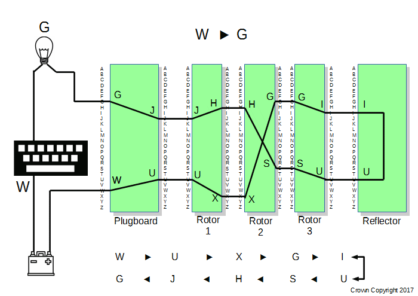

## What was Enigma and how did it work?

Enigma was a cipher machine created in the early 20th century for commercial, diplomatic and military applications. The machine was adopted by the German military during World War II for secret communications. The Enigma encryption code was famously broken at Bletchley Park, the forerunner of GCHQ, during WWII and intercepted radio messages from the German military successfully read. This spectacular achievement is thought to have shortened the war, and saved many lives on both sides of the conflict.

From an electrical point of view, the Enigma machine is simply a battery, bulb and switch circuit. There are no electronics, it is an electro-mechanical device. The encryption was achieved by varying the path of an electric current through the wiring of the machine.

### Rotors and reflector

A number of rotors with 26 contacts, one for each of the letters A-Z, were stacked together to create the current path though the heart of the machine. There were electrical contacts on both sides of each rotor wheel and a jumble of wiring between them so that the letters were transposed from one side to the other. By stacking several rotors and using a reflector at the end to return the current back through the rotors, it was possible to achieve many transpositions per letter, making it almost impossible to read the text.

### Plug board

As if this wasn't enough, a plug board was added to the original design which allowed up to ten pairs of letters to be manually transposed as they went into the rotors and again when they came back out.

In the diagram above, we show how a character on the keyboard went through many stages of transposition before being routed to a lightbulb on the lampboard represented the encrypted letter. The user would type their plain text message character by character on the keyboard and read the cipher text as each bulb was illuminated on the lampboard in response.

The Enigma machine had several complications. First, three rotors were selected from five that were available (there were also machines that used four rotors). The bottommost rotor advanced as the message was typed so that a different transposition of letters was used character by character. After the first rotor had advanced 26 positions, it advanced the next rotor by one, and so on.

### Slip rings
It was also possible to slip round the letter assignments on the side of the rotor wheel so that A = B, or A = C, etc. This made the encryption sequence discontinuous by changing the point at which the rotors advanced.

Combining three rotors from a set of five, the rotor settings with 26 positions, and the plugboard with ten pairs of letters connected, the military Enigma has 158,962,555,217,826,360,000 (nearly 159 quintillion) different settings.

In the photo above, we can see the jumble of wiring inside an expanded rotor wheel from a WWII captured Enigma machine.

The encryption relied on both the sending and receiving Enigma machines being set the same. To do this, a settings sheet was used at both communicating stations. The sheet specified:
- which rotors (of those available) should be selected and what order they should be inserted into the machine
- how much each rotor should be slipped round
- which letters should be changed by the plug board
- which rotor start position should be used

### Rotor start position and one off key

A different set of machine settings was used each day, and the rotor start position was changed every six hours, so the machine setting was very time sensitive. The user also selected three characters for themselves as a one-off message key for each message sent.

This is an Enigma settings sheet captured at the end of WWII which has been released by GCHQ for this project. You can see how the various settings are laid out in the expanded view of one of the lines on the sheet shown below.  

The settings we've highlighted are for the first day of the month and show that rotors IV, I and V should be selected and used in that order. The ring settings follow: rotor IV should be slipped round to position 20 (A = T), rotor I to 5 (A = E) and rotor V to position 10 (A = J). Next the wiring of the plug board should be S to X, K to U, Q to F, etc... Finally, the start position for the rotors should be "SRC", "EEJ, "FNZ" and "SZK" for each 6-hour period of the day.

There were two reflectors used, B or C. These had fixed transpositions of letters which ensured that the current returned back through the machine without it reversing the transposition on the return leg. We will assume reflector B has been used.
